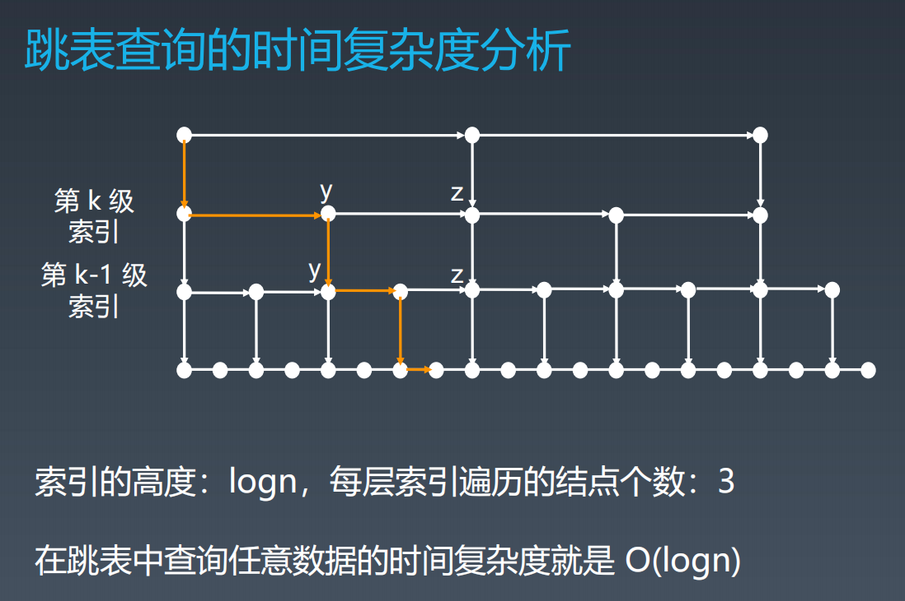

## 学习笔记

### Array 数组

> 定义

数组（Array）是一种线性表数据结构。它用一组连续的内存空间，来存储一组具有相同类型的数据。

- 线性表（Linear List）：顾名思义，线性表就是数据排成像一条线一样的结构。每个线性表上的数据最多只有前和后两个方向。其实除了数组，链表、队列、栈等也是线性表结构。
- `连续的内存空间` 和 `相同类型的数据`：正是因为这两个限制，它才有了一个堪称“杀手锏”的特性：“随机访问”。

> 增加

O(n)

插入：快排思想：将第 K 位移到数组最后，将要插入的数据放到第 K 位

> 删除

O(n)

删除：为了避免数据会被多次搬移，我们可以先**记录**下已经删除的数据。每次的删除操作并不是真正地搬移数据，只是**记录数据已经被删除**。当数组没有更多空间存储数据时，我们再触发执行一次真正的删除操作，这样就大大减少了删除操作导致的数据搬移。（**JVM 垃圾回收**）

> 查找（lookup）

O(1)

时间复杂度为 O(1) **表述不是很正常**

正确表述：数组支持随机访问，根据下标随机访问的时间复杂度为 O(1)。

> 例子

```java
// http://developer.classpath.org/doc/java/util/ArrayList-source.html

// 扩容数组
// 数组访问越界，即访问的数据，超出了数组的大小，导致越界
public void ensureCapacity(int minCapacity) {
  int current = data.length
  if (minCapacity > current)
    {
      E[] newData = (E[]) new Object[Math.max(current * 2, minCapacity)]; // 扩容原来的数组为原来的俩倍
      System.arraycopy(data, 0, newData, 0, size);  // 将老数组的值拷贝到新数组
      data = newData;
    }
}

// 末尾增加
public boolean add(E e) {
  modCount++;
  if (size == data.length)
    ensureCapacity(size + 1);
  data[size++] = e;
  return true;
}

// 某个index 增加
public void add(int index, E e) {
  checkBoundInclusive(index); // Checks that the index is in the range of possible elements (inclusive).
  modCount++;
  if (size == data.length)
    ensureCapacity(size + 1);
  if (index != size)
    System.arraycopy(data, index, data, index + 1, size - index);
  data[index] = e;
  size++;
}
```

### Linked List

类型：

单链表、双链表

> 增加

O(1)

> 删除

O(1)

> 查找

O(n)

>

> 工程应用

LRU Cache - Linked list

https://www.jianshu.com/p/b1ab4a170c3c

https://leetcode-cn.com/problems/lru-cache

Redis - Skip List

https://redisbook.readthedocs.io/en/latest/internal-datastruct/skiplist.html

https://www.zhihu.com/question/20202931

### 跳表（Skip List）

定义:

**必须是有序的链表**。跳表（skip list）对标的是平衡树（AVL Tree）和二分查找。最大的优势是原理简单、容易实现、方便扩展、效率更高。因此
在一些热门的项目里用来替代平衡树，如 Redis、LevelDB 等。

> 增加、删除

O(logn)

> 时间复杂度



> 空间复杂度

O(logn)

空间换时间
